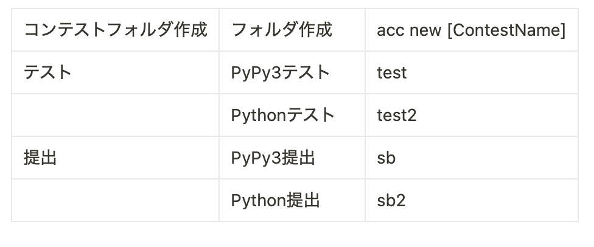

```
https://github.com/streamich/git-cz
npm install -g commitizen
npm install --save-dev git-cz

※ need sudo

```


npm run commit

コンテストフォルダ作成	フォルダ作成	acc new [ContestName]
テスト	PyPy3テスト	test
	Pythonテスト	test2
提出	PyPy3提出	sb
	Python提出	sb2